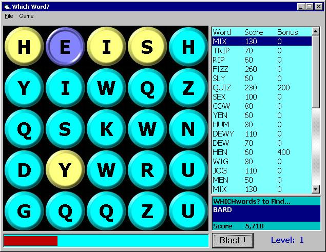

## Game: WHICHword?

### Description

Knock-off of MSN's WHATword game. Caution: can be addicting. Enjoy. The multi-thousand word dictionary, sounds & needed graphics will be installed from the included .res file. Updates uploaded 22 Jun/1925 to include Hall of Fame & minor tweaks to random letter generator routine & updated help file.
 
### More Info
 

             |
---                |---
**Submitted On**   |2003-06-22 13:54:58
**By**             |[LaVolpe](https://github.com/Planet-Source-Code/PSCIndex/blob/master/ByAuthor/lavolpe.md)
**Level**          |Advanced
**User Rating**    |5.0 (50 globes from 10 users)
**Compatibility**  |VB 6\.0
**Category**       |[Games](https://github.com/Planet-Source-Code/PSCIndex/blob/master/ByCategory/games__1-38.md)
**World**          |[Visual Basic](https://github.com/Planet-Source-Code/PSCIndex/blob/master/ByWorld/visual-basic.md)
**Archive File**   |[Game\_\_WHIC1604556222003\.zip](https://github.com/Planet-Source-Code/lavolpe-game-whichword__1-46311/archive/master.zip)

